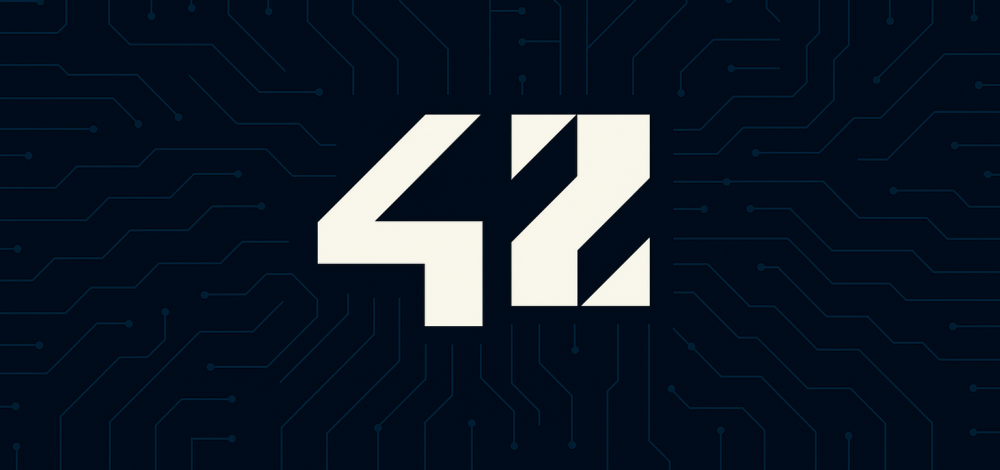
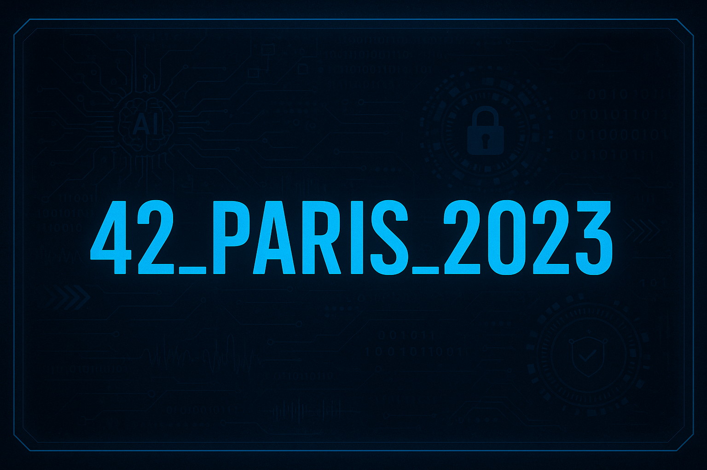
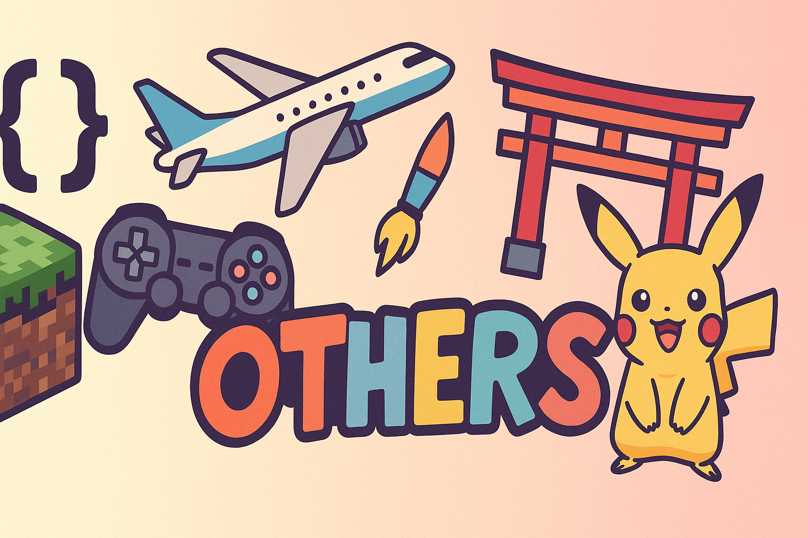

  

# École 42 – Personal Resources and Projects

This repository gathers personal notes, experiments, and resources related to my journey at **École 42**.  
Unlike the main cursus repositories, this section focuses on **side projects, extra exercises, and useful materials** that I developed outside of the official curriculum.  
It is meant as a complementary archive to support learning, experimentation, and creativity.

---

## 📚 Overview

- All BDE documents.  
- Scripts and utilities created during my time at 42.  
- Extra documentation, exams, and tips.  
- A place to try out new ideas beyond the standard cursus.

---

## 🗂 Repository Structure

- **BDE/** → All BDE documents from "Blackout".  
- **Distri/** → Distribution configuration and files from 42 session.  
- **exam/** → An exam trainer (not update for exam_05), and all exams (exam_04 in coming)
- **git42.sh** → A script to replace git command !

---

## 🎯 Goals

- Improve coding efficiency through custom tools.  
- Document useful knowledge and workflows.  
- Explore creative ideas not covered in the main cursus.  
- Share resources that could help future students.

---

## 🖼 Illustrations

<a href="https://github.com/Mechard-Organization/42_Paris/tree/main_42_Paris">  

---

## 🔗 Related Repositories

  &nbsp;&nbsp;&nbsp;&nbsp;

---
